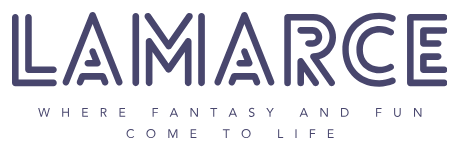

  
  

# Project Abstract
After creating a fake company called LAMARCE, the team focused on the creation of an arcade game complete with a Wii Nunchuk controller, LED matrix, and a wooden case to house all hardware in a clean and fun way. The team was inspired by video game arcades and wanted to understand how they work. So, the team created a simple, timed maze game inspired by the arcade game "Flamin' Finger." External peripherals such as the Wii Nunchuk and LED matrix were purchased while hardware like an STM23 Nucleo-32 Microcontroller Unit (MCU) and an iCE40 UP5K Field Programmable Gate Array (FPGA) were repurposed from Harvey Mudd College's engineering course on microprocessors. The team learned how to make all of these components work together and gained experience implementing communication protocols like Inter-Integrated Circuit (I2C) and Serial Peripheral Interface (SPI).

# Project Motivation
For this project, the team wanted something that can exist physically and show off what was learned in the microprocessor course. The team also valued applications that were fun and could be enjoyed by other students and faculty. So, the team decided to create some kind of game system that could be a fun artifact from the class as well as an opportunity to learn more about existing hardware and their applications.

# System Block Diagram

  

# Meet the Team!
## [Cecilia Li](https://www.linkedin.com/in/cecilia-huijie-li-722222243/)
An epic gamer that hit gold II

## [Lawrence Nelson](https://www.linkedin.com/in/lawrence-nelson-62b111237/)
A budding renewable energy engineer with an interest in almost every area of engineering and their applications to a happy society.

## [Martin Susanto](https://www.linkedin.com/in/martin-susanto-310721235/)
Will not hesitate to be handsome and tall

# Acknowledgements
The team would like to thank Prof. Josh Brake, Prof. Tina Smilkstein, and the HMC Microprocessor class of FA23 for their help and support throughout our project development.
